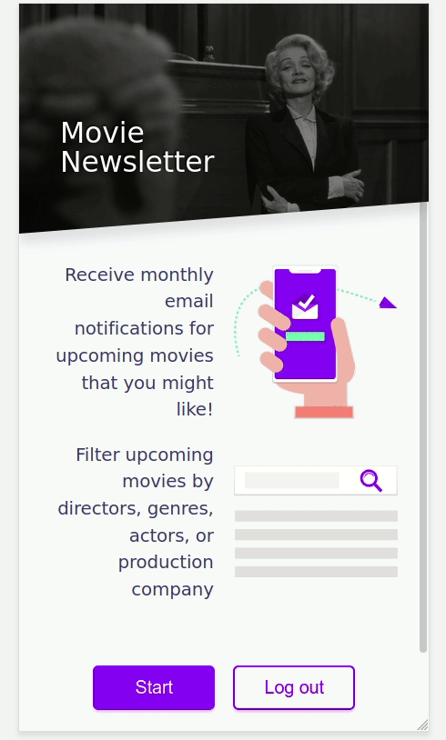

# Movie Newsletter

Users have the option to filter movies that will be released in the next three months by cast, director, production company and/or genre. The resulting list of movies will be sent to users via email on the first day of each month.

## Demo
Home View

This is a [Next.js](https://nextjs.org/) project bootstrapped with [`create-next-app`](https://github.com/zeit/next.js/tree/canary/packages/create-next-app). User information and preferences are stored on [Cloud Firestore](https://firebase.google.com/docs/firestore).
Info of upcoming movies is obtained from the [Tmdb API](https://developers.themoviedb.org/3/getting-started/introduction). Emails are composed with the help of [MJML](https://mjml.io/), templated with [Handlebars](https://handlebarsjs.com/) and finally sent via [SendGrid v3 API](https://sendgrid.com/docs/API_Reference/api_v3.html).
[Node schedule](https://www.npmjs.com/package/node-schedule) is responsible for scheduling when the emails are sent (first day of each month).

